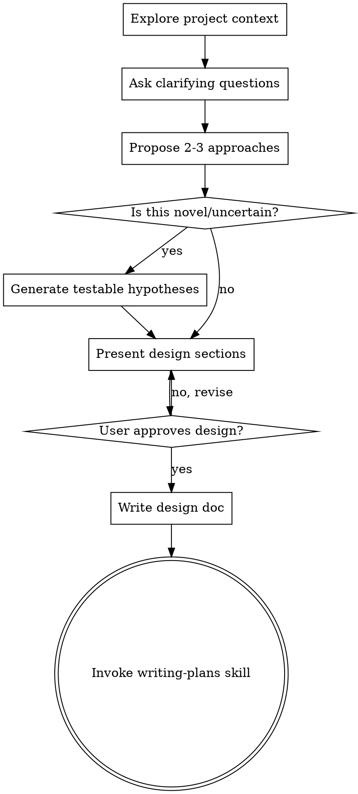

# Brainstorming Ideas Into Designs

## Overview

Help turn ideas into fully formed designs and specs through natural collaborative dialogue.

Start by understanding the current project context, then ask questions one at a time to refine the idea. Once you understand what you're building, present the design and get user approval.

<HARD-GATE>
Do NOT invoke any implementation skill, write any code, scaffold any project, or take any implementation action until you have presented a design and the user has approved it. This applies to EVERY project regardless of perceived simplicity.
</HARD-GATE>

## Anti-Pattern: "This Is Too Simple To Need A Design"

Every project goes through this process. A todo list, a single-function utility, a config change — all of them. "Simple" projects are where unexamined assumptions cause the most wasted work. The design can be short (a few sentences for truly simple projects), but you MUST present it and get approval.

## Novelty Detection: When to Generate Hypotheses

**Generate testable hypotheses when ANY of these apply:**

| Criterion | Example |
|-----------|---------|
| **Domain shift** | Translating C → Rust, Python → Go, imperative → functional |
| **Unknown algorithm** | Never implemented buddy allocator, B-tree, consensus protocol |
| **Complex assumptions** | Memory layout, performance characteristics, concurrency model |
| **User uncertainty** | User says "not sure if this works," "experimental," "need to verify" |
| **No prior art** | Custom protocol, novel data structure, unique architecture |

**SKIP hypothesis generation when ALL apply:**
- Standard patterns (CRUD, REST API, UI components)
- Well-documented libraries with clear examples
- Similar to previously implemented features
- User explicitly says "straightforward" or "simple"

## Checklist

You MUST create a task for each of these items and complete them in order:

1. **Explore project context** — check files, docs, recent commits
2. **Ask clarifying questions** — one at a time, understand purpose/constraints/success criteria
3. **Propose 2-3 approaches** — with trade-offs and your recommendation
4. **Assess novelty** — check if task is novel/uncertain (domain shift, unknown algorithm, complex assumptions)
5. **Generate hypotheses** (if novel) — formulate testable IF...THEN statements for critical assumptions
6. **Present design** — in sections scaled to complexity, include hypotheses if generated, get user approval
7. **Write design doc** — save to `docs/plans/YYYY-MM-DD-<topic>-design.md` and commit
8. **Transition to implementation** — invoke writing-plans skill to create implementation plan

## Process Flow



**The terminal state is invoking writing-plans.** Do NOT invoke frontend-design, mcp-builder, or any other implementation skill. The ONLY skill you invoke after brainstorming is writing-plans.

## The Process

**Understanding the idea:**
- Check out the current project state first (files, docs, recent commits)
- Ask questions one at a time to refine the idea
- Prefer multiple choice questions when possible, but open-ended is fine too
- Only one question per message - if a topic needs more exploration, break it into multiple questions
- Focus on understanding: purpose, constraints, success criteria

**Exploring approaches:**
- Propose 2-3 different approaches with trade-offs
- Present options conversationally with your recommendation and reasoning
- Lead with your recommended option and explain why

**Assessing novelty:**
- Check if ANY novelty criteria apply (domain shift, unknown algorithm, complex assumptions, user uncertainty)
- If ALL simple criteria apply, mark as simple and skip hypotheses
- Be conservative: when in doubt, generate hypotheses

**Generating hypotheses (for novel/uncertain tasks):**

For each critical assumption, create a testable hypothesis:

```markdown
**Hypothesis 1:** IF we use Box<[u8]> for the ring buffer backing store,
THEN the borrow checker will allow mutable access during read/write operations
without requiring unsafe code.

**Hypothesis 2:** IF we implement the buddy allocator using XOR for buddy address
calculation, THEN adjacent free blocks will correctly merge during deallocation.
```

**Rules for hypotheses:**
- Format: IF [assumption] THEN [expected verifiable outcome]
- Must be testable during implementation planning phase
- Each addresses ONE critical assumption
- Max 3-5 hypotheses per task (focus on riskiest assumptions)
- Include how you'll verify it (test case, benchmark, proof)

**Presenting the design:**
- Once you believe you understand what you're building, present the design
- Scale each section to its complexity: a few sentences if straightforward, up to 200-300 words if nuanced
- If hypotheses were generated, present them in a dedicated "Hypotheses" section
- Ask after each section whether it looks right so far
- Cover: architecture, components, data flow, error handling, testing, hypotheses (if applicable)
- Be ready to go back and clarify if something doesn't make sense

## After the Design

**Documentation:**
- Write the validated design to `docs/plans/YYYY-MM-DD-<topic>-design.md`
- Include "Hypotheses" section if generated
- Use elements-of-style:writing-clearly-and-concisely skill if available
- Commit the design document to git

**Implementation:**
- Invoke the writing-plans skill to create a detailed implementation plan
- **CRITICAL:** If hypotheses were generated, tell writing-plans: "This design includes testable hypotheses that must be verified during planning"
- Do NOT invoke any other skill. writing-plans is the next step.

## Key Principles

- **One question at a time** - Don't overwhelm with multiple questions
- **Multiple choice preferred** - Easier to answer than open-ended when possible
- **YAGNI ruthlessly** - Remove unnecessary features from all designs
- **Explore alternatives** - Always propose 2-3 approaches before settling
- **Incremental validation** - Present design, get approval before moving on
- **Be flexible** - Go back and clarify when something doesn't make sense

## Red Flags - Generate Hypotheses When You See These

- "I think this should work..."
- "Probably similar to [unrelated thing]..."
- "Let's try [approach] and see..."
- Translating between languages with different paradigms
- Implementing algorithms from papers without reference code
- Custom memory management, concurrency, or protocol design

## Examples

### Example 1: C-to-Rust Translation (Novel - Generate Hypotheses)

User: "Translate this C ring buffer to Rust"

**Assessment:** Domain shift (C → Rust), ownership model uncertainty

→ **GENERATE HYPOTHESES** about memory layout, borrow checker compatibility, etc.

### Example 2: Add Delete Button (Simple - Skip Hypotheses)

User: "Add a delete button to this React todo list"

**Assessment:** Standard React pattern, well-understood

→ **SKIP HYPOTHESES**

### Example 3: Custom Allocator (Novel - Generate Hypotheses)

User: "Implement a buddy memory allocator in Python"

**Assessment:** Unknown algorithm, assumptions about data structures

→ **GENERATE HYPOTHESES**
